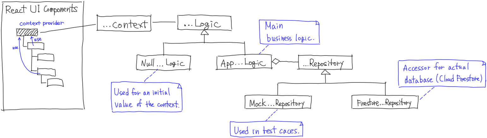

# MobConfVideo

https://mobconfvideo.firebaseapp.com/

MobConfVideo is a browser app to assist the meetup "カンファレンス動画鑑賞会" (Conference Video Viewing Party), which is being held in Tokushima, Japan.

## How to Develop

The project was bootstrapped with [Create React App](https://github.com/facebook/create-react-app).

This app uses Firebase Cloud Firestore in backend. A file `env.development.local` on root of project directory is needed for developing. It contains firebase project configuration like below:

```
REACT_APP_FIREBASE_CONFIG={ /* project configuration here */ }
```

### Run

```
npm start
```

Runs the app in the development mode.\
Open [http://localhost:3000](http://localhost:3000) to view it in the browser.

The page will reload if you make edits.\
You will also see any lint errors in the console.

### Test

```
npm test
```

Launches the test runner in the interactive watch mode.\
See the section about [running tests](https://facebook.github.io/create-react-app/docs/running-tests) for more information.

### Build for Deploy

```
npm run build
```

Builds the app for production to the `build` folder.\
It correctly bundles React in production mode and optimizes the build for the best performance.

The build is minified and the filenames include the hashes.\
Your app is ready to be deployed!

See the section about [deployment](https://facebook.github.io/create-react-app/docs/deployment) for more information.


## Architecture in Codes

The program is devided into several features.
Each feature is implemented in a directory in `src/features/`.

The feature directory may contain:

- React UI Components (*.tsx)
- Context types (*Context.js)
- Logic types (*Logic.ts)
- Test cases (*Logic.test.ts)
- Repository types (*Repository.ts)



Here we use "request" feature as an example.

Main business logics are implemented in `AppRequestLogic` class and it is abtracted to `RequestLogic` interface.

`RequestContext` is a React context and its provider provides an implementation of `RequestLogic`. UI components in the feature use it by `useContext()`.

An instance of `NullAppRequestLogic` class is provided as an initial value for the context though, it is not actually used. A context provider that provides an instance of `AppRequestLogic` exists at ancestor of these UI components. It is provided by `RequestProvider` component.

`AppRequestLogic` is initialized with `RequestRepository` object. It is an abstraction layer for accessing data.
`FirestoreRequestRepository` implements the interface and 
it reads from or writes to Cloud Firestore. Its instance is created by context provider for actual data access.

On testing, `MockRequestRepository` is used and works for mocking. It is implemented in `RequestLogic.test.ts` with test cases about `AppRequestLogic`.

For other features, implementations use the same pattern.
